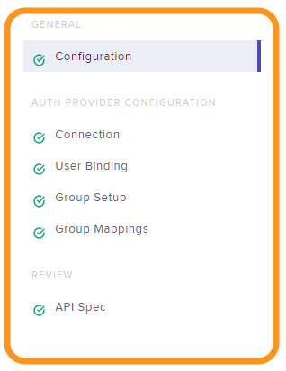

Lab 1 - Active Directory Authentication
#################################################

このラボではActivce Directory認証で設定されている内容とRole Based Access Controlの設定に追加確認します。
設定変更は行わず、設定済みの内容を確認します。

この機能により組織の既存環境で利用している認証のプロセスをNGINX Controllerに統合することが可能です

.. IMPORTANT::
    想定時間: 5分

.. NOTE::
    このLabの手順はラボを実施する方がWindows jumphost -- ``jumphost-1`` から操作する手順を示しています。
    接続方法についてはこちらを参照ください。 :ref:`overview` 

Authentication Providersの設定を確認する
--------------------------------------------------

#. jumphostのChromeで開かれているNGINX Controllerの管理画面を操作します。証明書エラーが表示されている場合には適切に操作をして画面を開いてください

   .. image:: ../media/ControllerLogin.png
      :width: 400

#. もし開かれていない場合、Chromeブラウザを開いてください

#. BookmarkからNGINX Controller UIにアクセスしてください

   .. image:: ../media/ControllerBookmark.png
      :width: 600

#. NGINX Controller のadmin accountである、``Peter Parker`` でログインしてください

   +-------------------------+-----------------+
   |      Username           |    Password     |
   +=========================+=================+
   | peter@acmefinancial.net | ``Peter123!@#`` |
   +-------------------------+-----------------+

   .. image:: ../media/ControllerLogin-Peter.png
      :width: 400

#. 画面左上のナビゲーションバーを開き、ドロップダウンリストから **Platform** を選択してください

   .. image:: ../media/Tile-Platform.png
      :width: 200

#. **Auth Providers** を開いてください

   .. image:: ./media/M1L1AuthProviders.png
      :width: 800

#. **Edit** をクリックし、``ad-acmefinancial-net`` の設定を確認してください 

   .. image:: ./media/M1L1ProviderEdit.png
      :width: 800

Authentication Provider の設定を確認する
--------------------------------------------------

このセクションでは、"Authentication Provider Configuration"タブを確認します。
関連する項目をクリックしてください

#. **Configuration** タブ

   この項目は、基本的な authentication providerの設定を定義します。必要となるパラメータは以下です:

   +--------------------+---------------------------------------------------------------------------------------+
   | Attribute          | Description                                                                           |
   +====================+=======================================================================================+
   | Auth Provider Type | Define the  authentication provider being used                                        |
   +--------------------+---------------------------------------------------------------------------------------+
   | User Format        | Define if the user will login with username@domain (UPN) or domain/user (User Domain) |
   +--------------------+---------------------------------------------------------------------------------------+

   .. NOTE::
      release 3.15 では、Active DirectoryのみをAuth Providerとして選択することが可能です

   .. image:: ./media/M1L1ProviderConfig.png
      :width: 800

#. **Connection** タブ

   このセクションはDomain、URL、SSLの設定を行います
   
   .. NOTE::
        **SSL Parameters** 配下に暗号化なしの接続を許可するためのオプションはありません

   この例では、すでにADの証明書が適切に提供されている状態となります

   .. image:: ./media/M1L1Connection.png
      :width: 800

#. **User Binding** タブ

   この項目は、NGINX ControllerがActive Directoryに対し認証を行う際に必要となる "Bind" で用いるアカウントの情報を指定します

   .. image:: ./media/M1L1UserBinding.png
      :width: 800

#. **Group Setup** タブ

   この項目は、Role Based Access Controlに使用する Active Directory のグループのために利用する、キャッシュとQueryパラメータを指定します

   .. image:: ./media/M1L1GroupSetup.png
      :width: 800

#. **Group Mappings** タブ

   この項目は、Active DirectoryのグループをNGINX Controller "内部(Internal)" で管理している "Roles Groups" への紐付けを指定します

   .. image:: ./media/M1L1GroupMappings.png
      :width: 800

   コントローラの "Roles Groups" は **Platform** -> **Roles** 配下で設定できます
   より詳細な情報をご覧になる場合には、NGINX Controller ドキュメントの managing `roles`_ を参照してください

   .. image:: ./media/M1L1RolesGroups.png
      :width: 800

   **Group Mapping** 設定で利用されているActive Directory Groupは以下の様にDomain Controllerで確認できます

   .. NOTE::
     以下の画像は参考です。Domain Controllerへログインし確認する必要はありません

   .. image:: ./media/M1L1ADGroups.png
      :width: 800

   .. NOTE::
     あなたは "Peter Parker" としてログインしています。"Peter" は "nginx-controller-admins" のメンバーです。
     このActive Directoryのグループは、NGINX Controllerの "admin_group" に割り当てられています

   .. image:: ./media/M1L1ADUsers.png
      :width: 600

   .. image:: ./media/M1L1ADControllerAdmins.png
      :width: 400

追加情報
--------------------

公開されているNGINX ControllerドキュメントはActive Directory authentication providerの詳細(`detail`_)について記述しています

.. _detail: https://docs.nginx.com/nginx-controller/platform/access-management/manage-active-directory-auth-provider/
.. _roles: https://docs.nginx.com/nginx-controller/platform/access-management/manage-roles/
