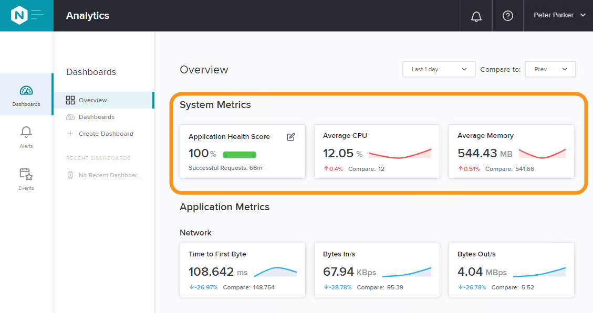
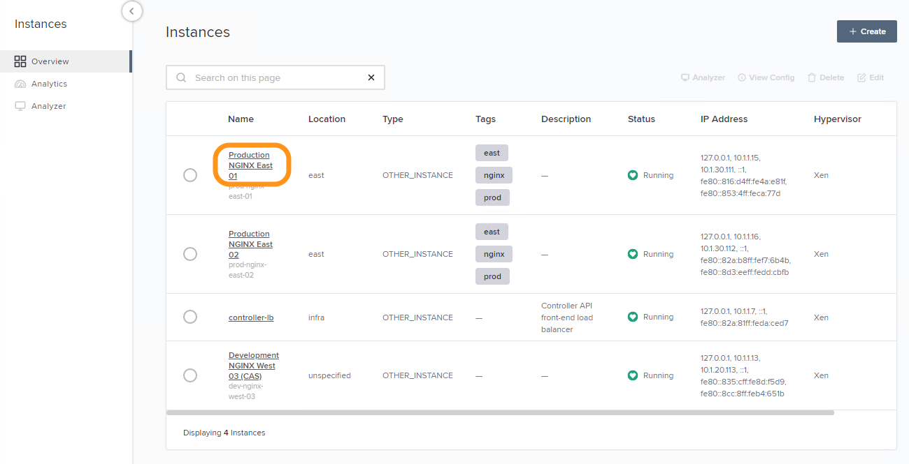
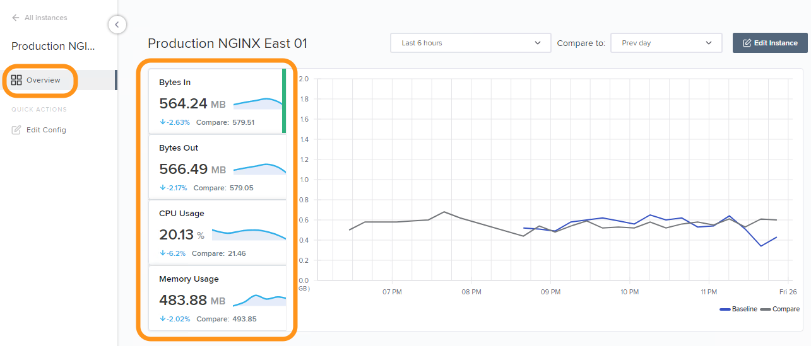
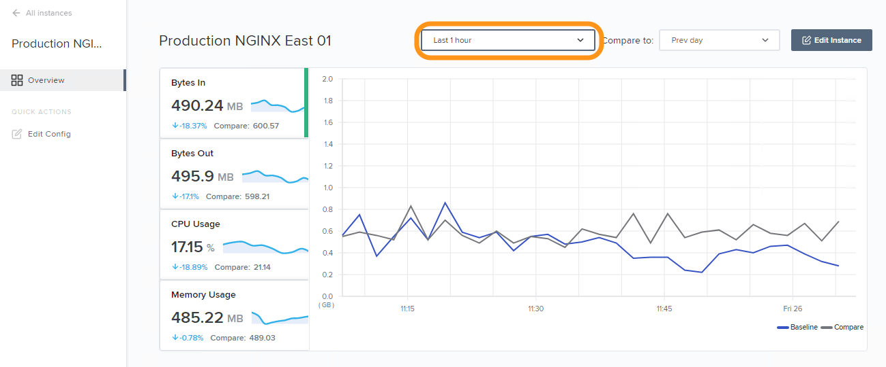

Lab 1 - NetOps/Admin向けAnalytics 
############################################

このラボのゴールはNGINX Controllerが提供するNGINX Plus instanceの統計状況を確認することです。
このAnalyticsのカテゴリは主にNetOpsの担当者向けとなります

.. IMPORTANT::
    想定時間: 5分

.. NOTE::
    このLabの手順はラボを実施する方がWindows jumphost -- ``jumphost-1`` から操作する手順を示しています。
    接続方法についてはこちらを参照ください。 :ref:`overview` 

Dashboard概要
-------------------

#. jumphostのChromeで開かれているNGINX Controllerの管理画面を操作します。証明書エラーが表示されている場合には適切に操作をして画面を開いてください

   .. image:: ../media/ControllerLogin.png
      :width: 400

#. もし開かれていない場合、Chromeブラウザを開いてください

#. BookmarkからNGINX Controller UIにアクセスしてください

   .. image:: ../media/ControllerBookmark.png
      :width: 600

#. NGINX Controller のadmin accountである、``Peter Parker`` でログインしてください

   +-------------------------+-----------------+
   |      Username           |    Password     |
   +=========================+=================+
   | peter@acmefinancial.net | ``Peter123!@#`` |
   +-------------------------+-----------------+

   .. image:: ../media/ControllerLogin-Peter.png
      :width: 400

#. ログイン後、Dashboardの"Overview"が表示されます。"System Metrics"セクションは、"Ovewview"の最上部に配置され、NetOps運用者が簡単に状態を把握することが可能となってます

   |Lab1MainDashboard|

Instance Analytics
-------------------

#. 画面左上のNavigation Barを選択し、表示されるドロップダウンリストから **Infrastructure** を選択してください

   .. image:: ../media/Tile-Infrastructure.png
      :width: 200

#. 表示されるインスタンスのリストから、**Production NGINX East 01** をクリックしてください 
   この画面は "Instance Overview" ページです。**Bytes In**、**Bytes Out**、**CPU Usage**、**Memory Usage** 等のメニューを選択し画面を切り替えてください
   
   |Lab1InstanceSelection|

   |Lab1InstanceDashboard|

   このセクションは選択したインスタンスの状態をシングルペインで簡単に確認することが可能です
   適切な時間でインスタンスのパフォーマンスがどの様になっているか確認するため、Time Rangeをドロップダウンリストから切り替えてください

   |Lab1InstanceAnalytics|

.. IMPORTANT::
   このラボの対象外となりますが、**Analytics -> Dashboards** も合わせてご確認ください
   NGINX Controllerによって集積される数百を超えるインスタンス・アプリケーションのメトリクスをDashboard elementとして表示することが可能です

.. |ControllerBtn| image:: media/0ControllerBtn.png
   :width: 1.59722in
   :height: 0.98611in
.. |Infrastructure| image:: media/0Infrastructure.png
   :width: 2.46535in
   :height: 0.53394in

