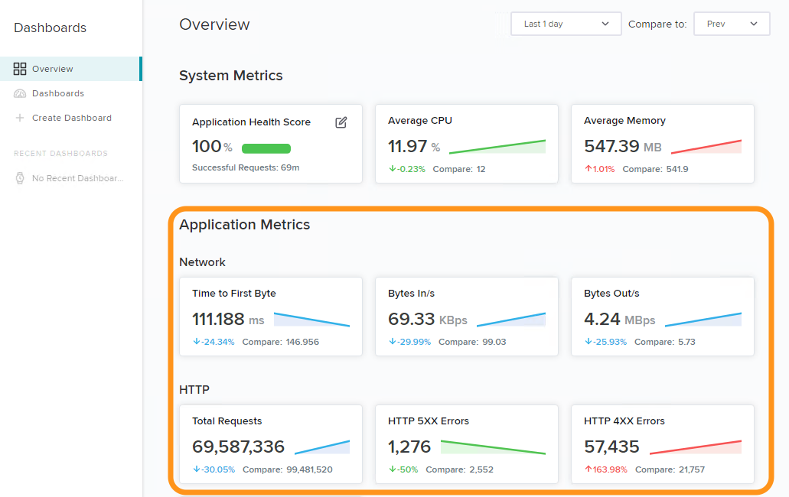
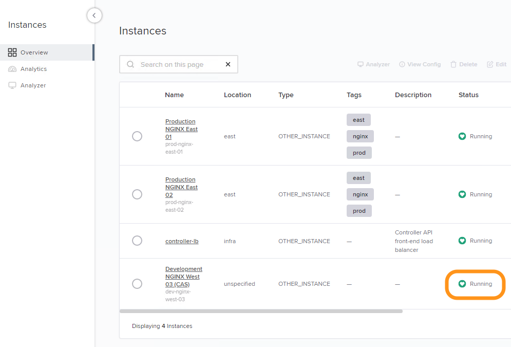
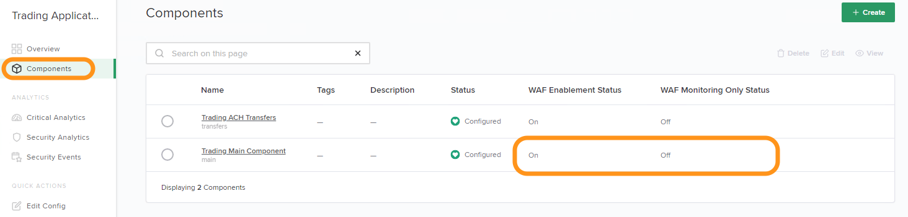
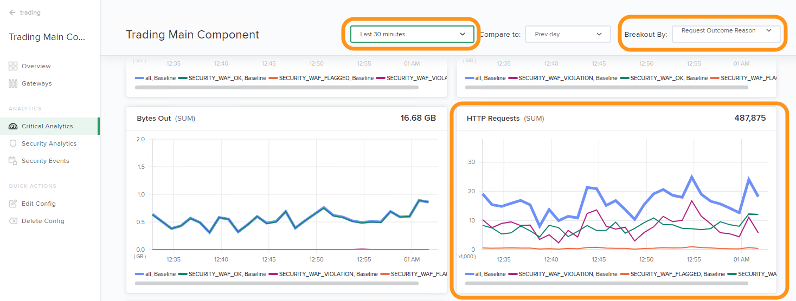

Lab 2 - DevOps/Developer向けAnalytics
################################################

このラボのゴールは
Controller App Security (CAS)のライセンスが有効な場合に、NGINX Controllerが提供するアプリケーションやWAFの分析結果を確認することです。
このAnalyticsのカテゴリは主に個々のアプリケーションやコンポーネントを管理するDevOps、開発の担当者向けとなります

.. IMPORTANT::
    想定時間: 5分

.. NOTE::
    このLabの手順はラボを実施する方がWindows jumphost -- ``jumphost-1`` から操作する手順を示しています。
    接続方法についてはこちらを参照ください。 :ref:`overview` 

Dashboard概要
-------------------

#. jumphostのChromeで開かれているNGINX Controllerの管理画面を操作します。証明書エラーが表示されている場合には適切に操作をして画面を開いてください

   .. image:: ../media/ControllerLogin.png
      :width: 400

#. もし開かれていない場合、Chromeブラウザを開いてください

#. BookmarkからNGINX Controller UIにアクセスしてください

   .. image:: ../media/ControllerBookmark.png
      :width: 600

#. NGINX Controller の特権を持たないuser accountである、``Natasha Romanoff`` でログインしてください

   +---------------------------+-------------------+
   |      Username             |    Password       |
   +===========================+===================+
   | natasha@acmefinancial.net | ``Natasha123!@#`` |
   +---------------------------+-------------------+

   .. image:: ../media/ControllerLogin-Natasha.png
      :width: 400

#. Nログイン後、Dashboardの"Overview"が表示されます。 
   "Application Metrics"のセクションは標準でDashboardに含まれる項目であり、DevOps、開発の担当者が簡単に状態を把握することが可能となってます

   |Lab2MainDashboard|

Critical Analytics
--------------------

#. 画面左上のNavigation Barを選択し、表示されるドロップダウンリストから **Infrastructure** を選択してください

   .. image:: ../media/Tile-Infrastructure.png
      :width: 200

#. 表示されるインスタンスのリストから、**Production NGINX East 03 (CAS)** をクリックしてください 
   インフラチームにより、NGINX App Protect (WAF) のモジュールを有効にしたNGINX Plus Insntanceが設定されています

   |image4|

   .. NOTE::
      NGINX Controller insntaceはこのラボで"Controller Application Security (CAS)"を利用しています

#.  画面左上のNavigation Barを選択し、表示されるドロップダウンリストから**Services**を開きます

   .. image:: ../media/Tile-Services.png
      :width: 200

#. **Apps** を選択してください

   .. image:: ../media/Services-Apps.png
      :width: 200

#. **Trading Application (CAS)** appを開いてください。"Analytics" セクションは"App"に含まれるすべての"Components"のデータをここに表示します

   .. image:: ./media/M3L2TradingRollup.png
      :width: 200

#. このラボでは、"Component"のレベルまでAnalyticsのデータをドリルダウンしたいと思います。
   **Components** セクションを選択します。DevOps、開発の担当者が管理するAppに対し、WAFポリシーを有効・向こうにする権限があることを確認してください
   ("Natasha"でログインしたことを思い出してください)

   |image6|

   .. NOTE:: 
      NGINX Controllerは設定したappに対し、self-serviceでWAFの有効・無効機能を提供しています
      
#. **Trading Main Component** をクリックし、**Critical Analytics** を左のナビゲーションから選択してください。
   右上の**Breakout By** のドロップダウンリストから **Request Outcome Reason** を選択してください。
   画面を下部へスクロールし、"HTTP Requests (SUM)" のグラフを確認ください
   
   |image7|

   .. NOTE::
      CAS が有効でない場合、このグラフは"すべて"のリクエストを含むのみとなります。次のモジュールでは、CASの機能を確認します

.. |ControllerBtn| image:: media/0ControllerBtn.png
   :width: 1.59722in
   :height: 0.98611in
.. |Infrastructure| image:: media/0Infrastructure.png
   :width: 2.46535in
   :height: 0.53394in

.. |image5| image:: media/image5.png
   :width: 800

