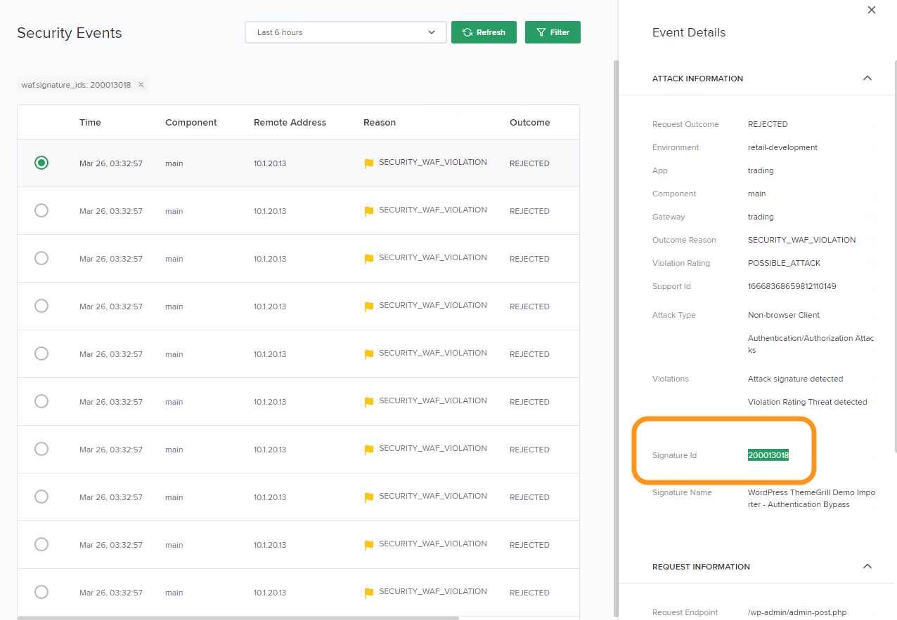

Lab 1 - Application Security (GUI)
#################################

このラボのゴールは、ポリシーが適用されたアプリケーションに関連するイベントやメトリクスを確認し、NGINX Controller Application Security Moduleを理解することでうｓ

.. IMPORTANT::
    想定時間: 15分

.. NOTE::
    このLabの手順はラボを実施する方がWindows jumphost -- ``jumphost-1`` から操作する手順を示しています。
    接続方法についてはこちらを参照ください。 :ref:`overview` 

Component の Security を有効にする
------------------------------

#. Chromeを開きます

#. BookmarkからNGINX Controller UIにアクセスしてください

   .. image:: ../media/ControllerBookmark.png
      :width: 600

#. NGINX Controllerの特権を持たないユーザである  ``Natasha Romanoff`` でログインしてください

+---------------------------+-------------------+
|      Username             |    Password       |
+===========================+===================+
| natasha@acmefinancial.net | ``Natasha123!@#`` |
+---------------------------+-------------------+

    .. image:: ../media/ControllerLogin-Natasha.png
        :width: 400

#.  **Services** メニューを開きます

    .. image:: ../media/Tile-Services.png
        :width: 200

#. **Apps** を選択します

    .. image:: ../media/Services-Apps.png
        :width: 200

#. "Trading Application (CAS)" app を開いてください 

    .. image:: ./media/TradingMainCASApp.png
        :width: 600

#. Overview にはAppのすべてのコンポーネントから集約されたデータやグラフが表示されます

    .. image:: ./media/TradingMainCASComponentOverview.png
        :width: 600

#. このラボでは、コンポーネントでWAFが有効になっていることを確認します。
   **Components** セクションを選択し、**Trading Main Component** をクリックします

    .. image:: ./media/TradingMainCASComponent.png
        :width: 600

#. **Edit Component** ボタンをクリックします

    .. image:: ./media/TradingMainCASEditComponent.png
        :width: 600

#. **Security** リンクをクリックします。このコンポーネントですでにWAFが有効になっていることが確認できます。
   トグルボタンにチェックマークが表示されています。アプリケーションを管理する DevOps / 開発者 がWAFの有効・無効を制御することができることを確認してください。
    ("Natasha"でログインしたことを思い出してください)
    
    .. NOTE:: 
        NGINX Controllerは設定したappに対し、self-serviceでWAFの有効・無効機能を提供しています
    
    .. NOTE:: 
        Retail Development environmentでWAFを有効にしたことにより、Acme Financial corporationにおけるリスクを最小化することができています。
        これは、コンポーネントの **Monitor Only** がオフになっていることが示しています 

    .. image:: media/TradingMainCASComponentEnableWAF.png
        :width: 800

Security Analytics を確認する
--------------------------

#. "Trading Application (CAS)" appで、**Components** セクションを選択し、**Trading Main Component** をクリックしてください

    .. image:: ./media/TradingMainCASComponent.png
        :width: 600

#. **Security Analytics** リンクをクリックします。ここで選択したコンポーネントに関するセキュリティに関する統計情報などが表示されます
        
    .. image:: ./media/TradingMainCASSecurityAnalytics.png
        :width: 600

#. ドロップダウンリストから **Last 30 minutes** を選択します。**WAF Suspicious vs Normal Traffic** まで画面をスクロールします。
   トラフィックジェネレータがこのコンポーネントに対し動作した事により、グラフが表示されていることが確認できます。
   これはオペレータが指定した時間間隔の中で悪意あるトラフィックの急激な増加を直ちに知ることができます。以前の時間と比較しし、セキュリティイベントの急激な変化ないか確認してください(**Prev Day** がデフォルトで選択されています) 次のステップで利用するため、グラフの急激な増加が見られた地点にマウスを置き、その発生時間をメモしてください
   
    .. image:: media/TradingMainCASSecurityAnalyticsLast30.png
        :width: 800

#. "Top URIs Targeted" list" まで画面をスクロールしてください。このリストは攻撃の対象となったURIを多いものから表示します。
   右のドロップダウンに表示されるオプションからフィルタリング機能を利用することが可能です

    .. image:: media/AnalyticsTopURIs.png
        :width: 800

#. "WAF Top Threats" リストを確認するため、画面をスクロールしてください。このリストは、**Attack Types** (default selection)や、**Signatures** を元にした脅威をリストにしたものです
   右のドロップダウンに表示されるオプションからフィルタリング機能を利用することが可能です

    .. image:: media/AnalyticsTopThreats.png
        :width: 800

.. NOTE::
    イベントデータの量に依存して、"WAF Top Threats" リストの表示に時間がかかる場合があります

.. NOTE::
    WAFをMonitor Only Modeでデプロイした場合にも、Analytics や イベントのデータは潜在的な攻撃を判断するために有用です。また、これらのデータをSplunkやDatadogに送付することが可能です

Security Events を確認する
-----------------------

#. **Security Events** をクリックしてください。ここはセキュリティイベントが記録されており、リクエストの詳細などが確認できます

    .. image:: ./media/TradingMainCASComponentEvents.png

#. 対象となる日時を選択し、グラフを確認します。**Last 24 hours** と現在表示されているドロップダウンリストをクリックし、**Last 5 minutes** を選択します 

    .. image:: ./media/TradingMainCASComponentEventsLast5.png

#. より詳細なセキュリティの情報を確認するため、特定の行をクリックします。画面右側にイベントの詳細が表示されます

    .. image:: ./media/TradingMainCASComponentEventsDetails.png

#. **THREAT ORIGIN** セクションで詳細を確認するため画面をスクロールし、**Remote Address** のフィールドを確認してください。マウスカーソルをこの項目に合わせ、**funnel** アイコンをクリックしてください。この操作により、フィルタを作成します。この操作により、"Security Events" リストを "remote address" でフィルタしました

    .. image:: ./media/TradingMainCASComponentEventsDetailsIP.png
        :width: 400

    .. NOTE::
        Notice that many "Event Details" data points can be used as filters. This powerful filtering feature allows for quick pattern detection.

#. 現在特定のIPアドレスでフィルタされたセキュリティイベントリストが表示されています。
   フィルタされたリストから、アクセスもととなるユーザは妥当なユーザであるかどうか確認してください

    .. image:: ./media/TradingMainCASComponentEventsDetailsIPFiltered.png

#. **Security Analytics** リンクをクリックしてください。イベントに関連する Signature ID を確認するため、**WAF Tuning** リンクをクリックしてください。

    .. image:: ./media/TradingMainCASComponentTuning.png
    
#. ID **200013018** のSignatureをクリックしてください。高いパーセンテージを示すViolationとして表示されています。
   これはリクエストに対する意図しないブロックでしょうか？"False Positive(誤検知)"が発生している可能性もあります

#. **View Events** ボタンをクリックし、このリクエストが誤検知であるかどうか確認するためリクエストの情報を確認します
    
    .. image:: ./media/TradingMainCASComponentTuningSelect.png

#. 前のステップで、Attack Signatureでフィルタされたセキュリティイベントのリストが表示されています。拒否されたリクエストの一つをクリックし、右に表示される詳細を確認してください

    .. image:: ./media/TradingMainCASComponentEventsDetailsSigFiltered.png

#. 拒否の詳細を確認するため **THREAT TARGET** セクションを確認してください。以下の **Request Detail** でハイライトされた部分を確認してください。これは実際にWAFが拒否したGETリクエストです:

    .. image:: ./media/TradingMainCASComponentEventsRequest.png

#. クロームで新しいタプを開き、開発者ツールを有効にした状態でアプリケーションにアクセスしてください
   URLは `http://trading.acmefinancial.net/wp-admin/admin-post.php?do_reset_wordpress`` です。このリクエストでユーザにどの様に見えるか、動作を確認してください。
   何が見えましたでしょうか？ レスポンスに "Support ID" が確認できます。これはセキュリティログの詳細にも記録されるこのイベントを示すIDです

    .. image:: ./media/TradingMainCASComponentBlocked.png

#. このラボではリクエストが誤検知であると想定して確認を進めました。NGINX Controllerの管理画面で、次のセクションで利用するため、Signature IDをイベントの詳細からコピーしてください

WAF policy のチューニング
-------------------

#. コンポーネントのSecurity Configurationを変更するため、**Edit Config** をクリックしてください

    .. image:: ./media/TradingMainCASComponentEventsQuickEdit.png
    
#. **Security** をクリックし、signature ID ``200013018`` を "Disable Signatures" テキストボックスに貼り付けてください
    
    .. image:: ./media/TradingMainCASComponentSignature.png

#. コンポーネントのセキュリティポリシーを更新するため **Submit** をクリックしてください

    .. image:: ../media/Submit.png
        :width: 100

.. NOTE::
    WAF コンポーネントの設定が完了すると、以下のように見えます:

#. 少なくとも30秒間の間を開け、再度ブラウザでの接続を試してください。現在はリクエストが許可されることを確認してください(出力は 404エラー ですがWAFによる制御は行われない状態となっています).

    .. image:: ./media/TradingMainCASComponentNotBlocked.png

